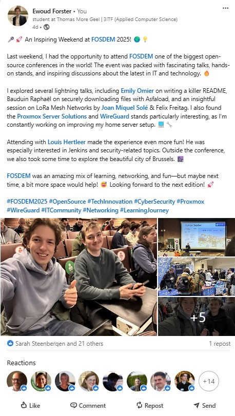

# Een Inspirerend Weekend op FOSDEM 2025!

Afgelopen weekend, op 1 en 2 februari, zijn Louis Hertleer en ik naar Brussel gereisd om FOSDEM 2025 bij te wonen, een van de grootste open-source conferenties ter wereld. We namen de trein vroeg in de ochtend om optimaal van de dag te kunnen profiteren.

## Dag 1: Lezingen en Ontdekkingen

Bij aankomst op de conferentie werden we overweldigd door de drukte en de energieke sfeer. Onze eerste sessie was een lezing over **Poppler**, de PDF-rendering bibliotheek. De presentatie werd gegeven door Albert Astals Cid, die sinds 2003 betrokken is bij KDE, sinds 2005 Poppler-ontwikkelaar is en sinds 2008 de maintainer. Hij besprak de evolutie van Poppler en de rol ervan in bijna alle Linux-distributies voor PDF-weergave.

Vervolgens woonden we een presentatie bij over **Asfaload**, gepresenteerd door Bauduin Raphaël. Hij benadrukte de beperkingen van traditionele checksums bij het verifiëren van de authenticiteit van gedownloade bestanden en introduceerde Asfaload als een oplossing die gebruikmaakt van Git als datastore en Minisign voor ondertekende checksums.

Na een korte pauze gingen we naar de lezing van Klaus Aehlig over het onafhankelijk behandelen van build-definities, gevolgd door een sessie van Cyril Servant, een HPX-engineer bij CEA, over **SSHProxy** en hoe SSH-verbindingen te load balancen. Beide presentaties boden diepgaande inzichten in respectievelijk build-systemen en netwerkbeveiliging.

Een andere boeiende sessie werd gegeven door Joan Miquel Solé en Felix Freitag over **LoRaMesher**, een bibliotheek voor het creëren van mesh-netwerken met behulp van LoRa-technologie. Dit opent de deur naar robuuste en schaalbare IoT-oplossingen.

Tussen de lezingen door bezochten we verschillende stands, waaronder die van CERN Open Source, Aleksis, PrivacyIDEA, Drupal, Instant GraphQL API, Grafana Labs en Proxmox. Vooral Proxmox trok mijn aandacht, aangezien ik thuis een homeserver heb waarop ik Proxmox als virtualisatieplatform gebruik. Het was geweldig om direct met de ontwikkelaars te spreken en meer te leren over toekomstige updates en best practices.

## Avonturen in Brussel

Na een dag vol technologie besloten we de stad te verkennen. We genoten van de prachtige architectuur van Brussel en trakteerden onszelf op heerlijke lokale gerechten.

Overnachten in een hotel gaf ons de kans om volledig op te gaan in de ervaring zonder tijd te verliezen aan reizen, en het was ook een milieuvriendelijke keuze.

## Dag 2: Hardware en IoT

Op de tweede dag richtten we ons op hardware en IoT. We bezochten stands van **OpenRemote**, een open-source IoT-platform dat integratie van verschillende apparaten en protocollen mogelijk maakt. Dit was bijzonder interessant gezien mijn interesse in domotica en het automatiseren van mijn huis.

Daarnaast bezochten we de stand van **Philips Hue**, waar we meer leerden over hun nieuwste slimme verlichtingsoplossingen. Aangezien ik thuis gebruik maak van Philips Hue-lampen en andere Zigbee-apparaten die ik via mijn homeserver en Homebridge integreer in de Apple Woning-app, was dit bijzonder relevant.

Buiten kwamen we een zelfgemaakt weerstation tegen, wat ons inspireerde om na te denken over eigen DIY-projecten.

## Inspirerende Lightning Talks

Een van de hoogtepunten was de lightning talk van Emily Omier over het schrijven van een killer README. Ze benadrukte het belang van een duidelijke en beknopte README als de homepage van je project en gaf tips over hoe je de waarde en unieke aspecten van je project kunt communiceren.

Ook de stand van **WireGuard** trok onze aandacht. WireGuard is een eenvoudig te configureren VPN-tool die bekend staat om zijn snelheid en veiligheid.

Tot slot bezochten we de stand van **Let's Encrypt**, een dienst die gratis SSL-certificaten aanbiedt. Aangezien ik Let's Encrypt gebruik voor mijn Nginx Proxy Manager om mijn domeinen te beveiligen met SSL, was het waardevol om meer te leren over hun nieuwste ontwikkelingen.

## Conclusie

FOSDEM 2025 was een ongelooflijk leerzaam en inspirerend weekend. We hebben ons uitstekend vermaakt, veel bijgeleerd en nieuwe contacten gelegd.

