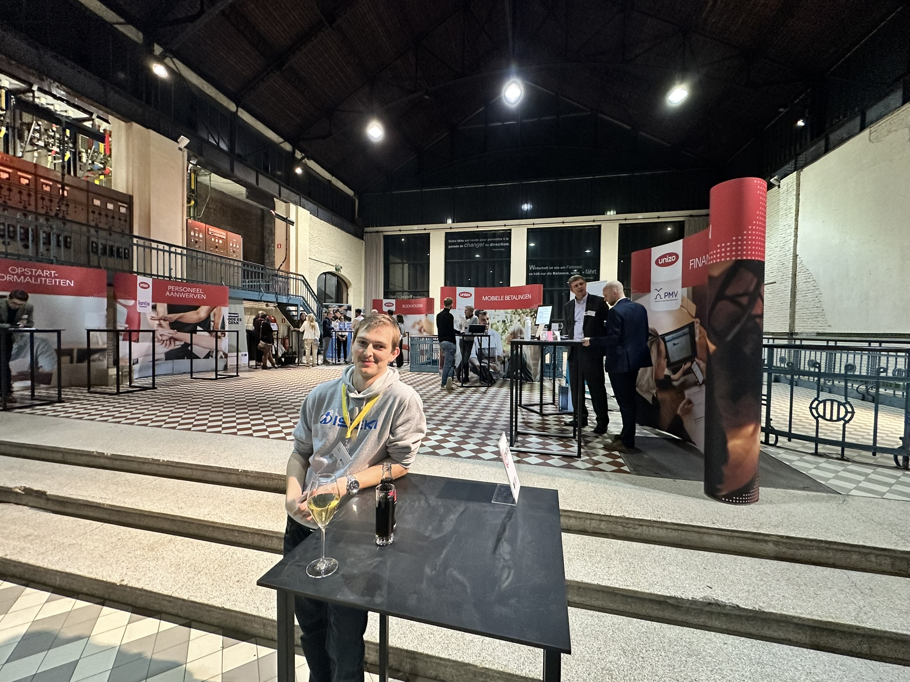
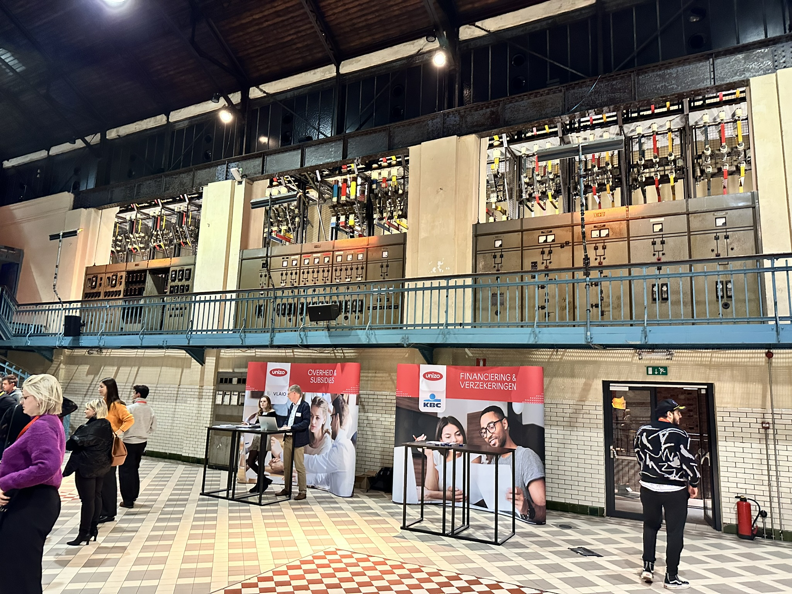
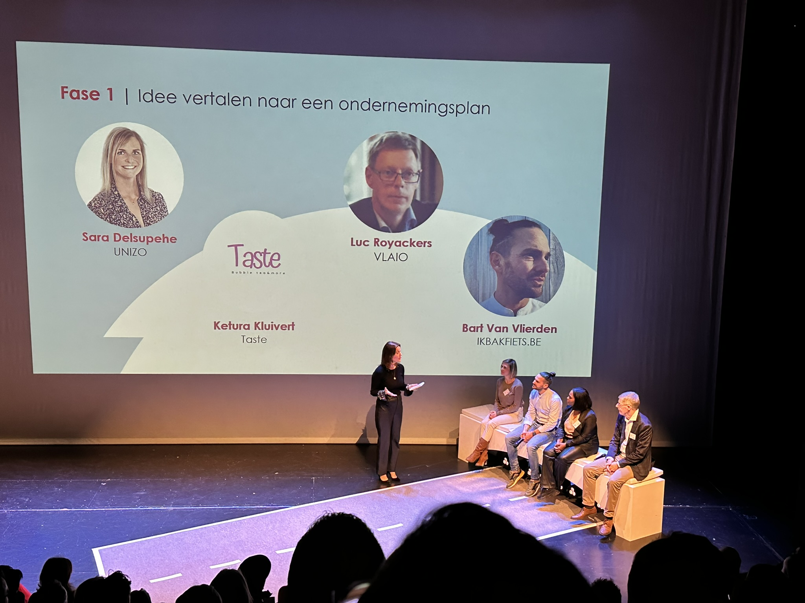
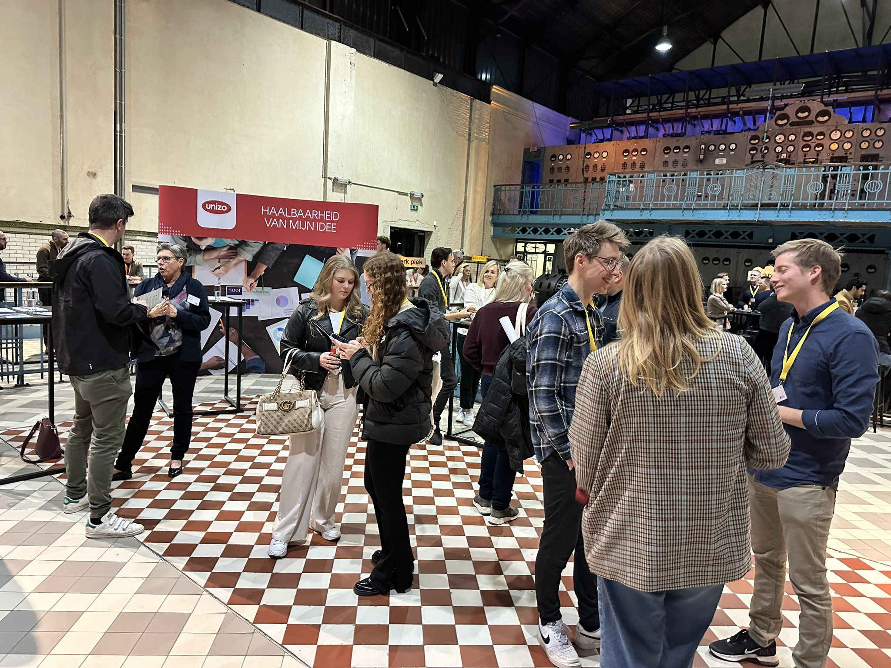
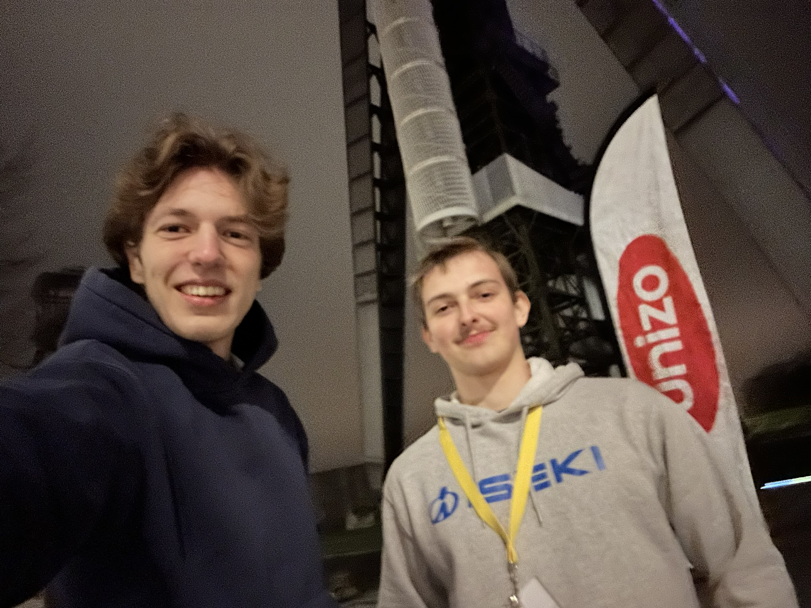

# Starters RoadShow

Op 11 december 2024 gingen Louis en ik naar de **UNIZO Startersroadshow** in C-Mine, Genk. Een inspirerende avond vol inzichten, netwerkmogelijkheden en heerlijk eten en drinken. Als ondernemende student is dit voor mij een grote sprong, dus elke kans om advies te vragen is enorm waardevol. 

## Adviesmarkt (17:00)

Bij aankomst werden we meteen ondergedompeld in een bruisende sfeer. De adviesmarkt voelde als een snoepwinkel voor startende ondernemers. Overal stonden experts klaar om vragen te beantwoorden over onderwerpen zoals:

- Opstartformaliteiten en het traject van een onderneming
- Boekhouding en mobiele betalingen
- Diverse financieringsmogelijkheden
- Opleidingen en begeleiding
- Verzekeringen, subsidies en overheidssteun
- De haalbaarheid van een ondernemersidee

Het was een unieke kans om direct in gesprek te gaan met professionals en meteen gerichte antwoorden te krijgen op onze vragen. 

## Crash Course Netwerken (17:30)

Na het eerste adviesmoment volgde een interactieve **Crash Course Netwerken**. In deze sessie kregen we de kans om met andere ondernemers in gesprek te gaan onder begeleiding van een mentor. We leerden hoe je een gesprek soepel op gang houdt en hoe je een sterk netwerk opbouwt. Dit bleek super waardevol en gaf ons direct toepasbare inzichten voor het dagelijkse ondernemersleven.

## Startersroadshow Presentatie (18:15)

Na een korte pauze met hapjes en drankjes, verhuisden we naar de hoofdzaal voor de live presentatie. **Dorien Leyers** leidde de show en bracht haar boodschap met veel energie. 

We hoorden inspirerende verhalen van ondernemers zoals:
- **Bart Van Vlierden (IKBAKFIETS)** – over creativiteit en doorzettingsvermogen in de nichemarkt
- **Ketura Kluivert (Taste)** – haar reis van idee naar succesvolle zaak

Naast de succesverhalen werd ook aandacht besteed aan uitdagingen en knelpunten bij het ondernemen. Het was verfrissend om eerlijke verhalen te horen over de obstakels die ondernemers tegenkomen en hoe ze die hebben overwonnen.

## Expertsessies 

Na de live show kregen we opnieuw de kans om in gesprek te gaan met experts. Dit was hét moment om gerichte vragen te stellen over onderwerpen waar we verder in willen groeien. De sessies gaven praktische inzichten in de verschillende fases van het ondernemerschap.

## Netwerken en Afsluiting

De avond werd afgesloten met een gezellige netwerkborrel. Hier spraken we opnieuw met mede-starters en ervaringsdeskundigen. De informele sfeer maakte het makkelijk om ervaringen uit te wisselen en connecties te leggen die in de toekomst nog van pas kunnen komen.

De **UNIZO Startersroadshow** was een waardevolle ervaring die ons inspireerde en motiveerde om verder te bouwen aan onze ondernemersreis. We kijken alvast uit naar toekomstige evenementen en verdere groeimogelijkheden!

