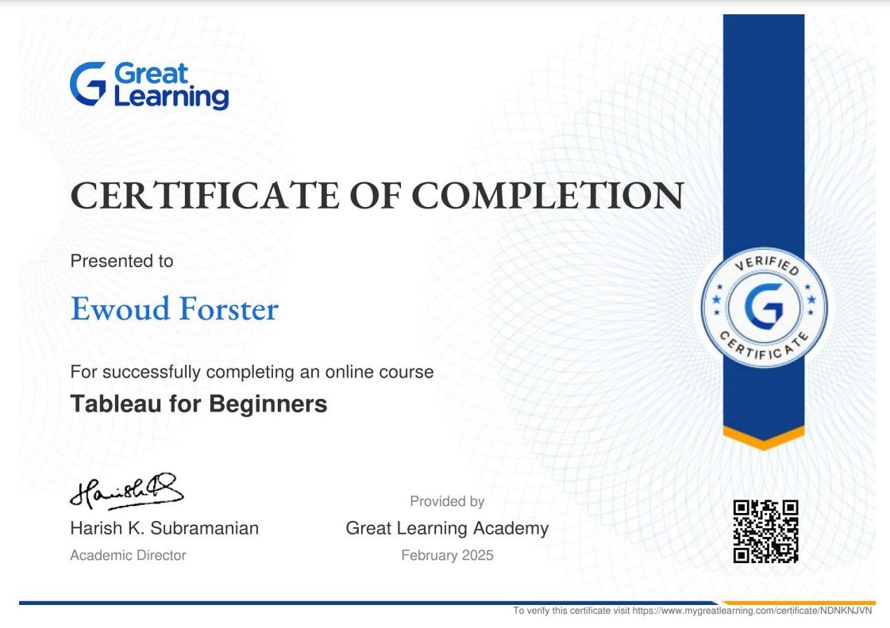

# Tableau voor Beginners: Mijn Aantekeningen

## Overzicht

Deze cursus is bedoeld om me de basisprincipes van Tableau bij te brengen, een krachtig tool voor data-visualisatie. Het doel is om te leren hoe ik data kan omzetten in inzichtelijke en aantrekkelijke visuals.

## Inhoudsopgave

1. [Introductie tot Data-Visualisatie](#introductie-tot-data-visualisatie)
2. [Verbinden met Data in Tableau](#verbinden-met-data-in-tableau)
3. [Dimensies en Maatstaven Begrijpen](#dimensies-en-maatstaven-begrijpen)
4. [Verschillende Grafiektypen Maken](#verschillende-grafiektypen-maken)
5. [Storytelling met Data](#storytelling-met-data)
6. [Interactie in Dashboards](#interactie-in-dashboards)
7. [Berekeningen en Functies Gebruiken](#berekeningen-en-functies-gebruiken)
8. [Geavanceerde Visualisatietechnieken](#geavanceerde-visualisatietechnieken)

---

## Introductie tot Data-Visualisatie

- **Waarom Data-Visualisatie?**
  - In de jaren '80 begon men meer data te verzamelen dankzij nieuwe technologieën.
  - IBM ontdekte in 2013 dat 90% van de wereldwijde data in 2011 en 2012 was gegenereerd.
  - Het is essentieel om deze data te analyseren om niet achter te blijven.

- **Het Brein en Visualisatie**
  - Ons brein is sterk gericht op visuele informatie; we herkennen patronen en trends snel.
  - Data-visualisatie is een gestructureerd proces dat hierop inspeelt.

## Verbinden met Data in Tableau

- **Data Importeren**
  - Tableau kan verbinding maken met verschillende bronnen zoals Excel, tekstbestanden en databases.
  - Er zijn twee manieren om data te verbinden: live verbindingen en geëxtraheerde data.

- **Live vs. Extracted Data**
  - **Live:** Real-time updates, maar kan trager zijn.
  - **Extracted:** Statische snapshot van data; sneller, maar niet real-time.

## Dimensies en Maatstaven Begrijpen

- **Dimensies**
  - Kwalitatieve data, zoals namen of categorieën.
  - Worden gebruikt om data te segmenteren.

- **Maatstaven**
  - Kwantitatieve data, zoals verkoopcijfers of aantallen.
  - Worden geaggregeerd in visualisaties.

## Verschillende Grafiektypen Maken

- **Staafdiagrammen**
  - Goed voor het vergelijken van categorieën.

- **Lijndiagrammen**
  - Ideaal voor trends over tijd.

- **Cirkeldiagrammen**
  - Laat delen van een geheel zien; voorzichtig mee zijn.

- **Spreidingsdiagrammen**
  - Toont relaties tussen twee variabelen.

- **Histogrammen**
  - Laat de verdeling van data zien.

## Storytelling met Data

- **Verhalen Vertellen**
  - Gebruik meerdere visualisaties om een verhaal te vertellen.
  - Leid de kijker door de inzichten met een logische flow.

- **Story Points**
  - Specifieke momenten in je data benadrukken.

## Interactie in Dashboards

- **Dashboards Maken**
  - Combineer verschillende visualisaties op één scherm.
  - Maak het interactief met filters en acties.

- **Filters en Acties**
  - Laat gebruikers data verkennen door selecties en filters.

## Berekeningen en Functies Gebruiken

- **Berekende Velden**
  - Maak nieuwe data op basis van bestaande velden.

- **Basisfuncties**
  - Stringfuncties: werken met tekst.
  - Datumfuncties: bijvoorbeeld DATEDIFF om verschillen tussen data te berekenen.

## Geavanceerde Visualisatietechnieken

- **Geospatiale Analyse**
  - Maak kaarten en analyseer geografische data.

- **Parameters**
  - Voeg flexibiliteit toe aan je visualisaties; laat gebruikers waarden aanpassen.

